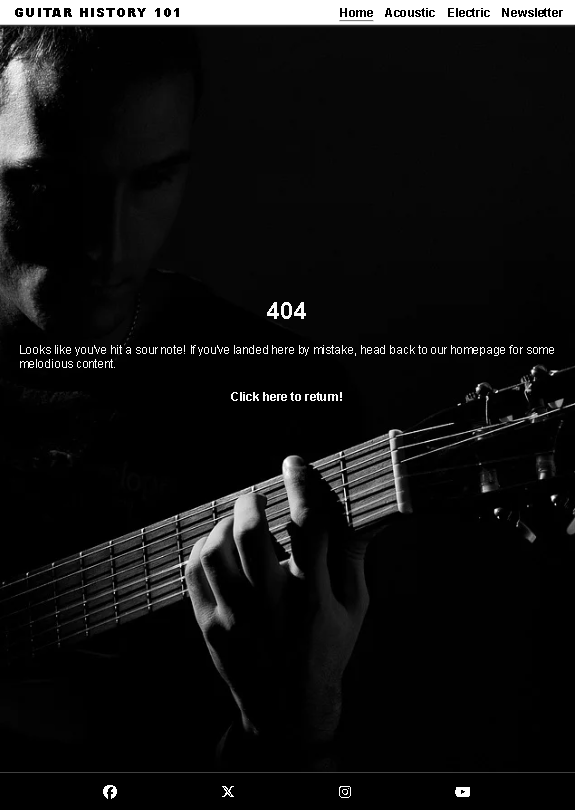
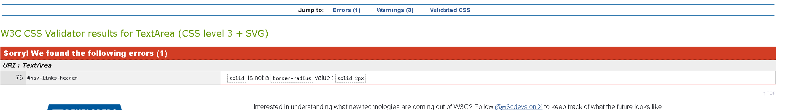
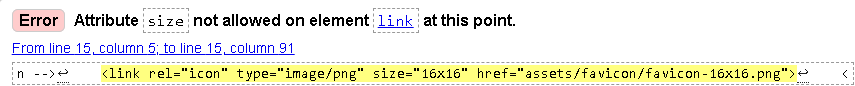

# Guitar History 101

Guitar History 101 is a website crafted to provide users with a succinct initiation into acoustic and electric guitars. Each page dedicated to these instruments delivers historical perspectives, accompanied by a sample video showcasing acclaimed musicians like Tommy Emmanuel for acoustic and Joe Satriani for electric, alongside a brief overview of their backgrounds and stylistic approaches.

Visit the deployed website [here](https://seanpatton1.github.io/History-Acoustic-and-Electric-Guitar/index.html).

## Table of Contents

1. [User Experience (UX)](#user-experience-ux)
    1. [Project Goals](#project-goals)
    2. [User Stories](#user-stories)
    3. [Color Scheme](#color-scheme)
    4. [Typography](#typography)
    5. [Basic Design](#wireframes)
2. [Features](#features)
    1. [General](#general)
    2. [Landing Page](#landing-page)
    3. [Acoustic Page](#acoustic-guitar-page)
    4. [Electric Page](#electric-guitar-page)
    5. [Newsletter Page](#newsletter-page)
    6. [404 Error Page](#404-error-page)
 3. [Technologies Used](#technologies-used)
    1. [Languages Used](#languages-used)
    2. [Libraries and Programs Used](#libraries-and-programs-used)
4. [Testing](#testing)
    1. [Testing User Stories](#testing-user-stories)
    2. [Code Validation](#code-validation)
    3. [Accessibility](#accessibility)
    4. [Tools Testing](#tools-testing)
    5. [Manual Testing](#manual-testing)
5. [Finished Product](#finished-product)
6. [Deployment](#deployment)
    1. [GitHub Pages](#github-pages)
7. [Credits](#credits)
    1. [Content](#content)
    2. [Media](#media)
    3. [Code](#code)
8. [Acknowledgements](#acknowledgements)

***

## User Experience (UX)

### Project Goals

* The website's landing page design embodies a minimalist aesthetic, featuring clickable images representing both acoustic and electric guitars, creating an intuitive user interface for navigation.

* Both the acoustic and electric pages delve into the instrument's historical background, featuring demonstrations of musicians playing them along with brief biographical information about each artist.

* Offers the user a concise description of the instrument without overwhelming them with excessive information.

* Provides the option to subscribe to a newsletter regarding the instruments, offering updates on any new information or developments related to both.

### User Stories

* As a customer, I want to delve into the website's content, aiming to uncover information about both acoustic and electric guitars through navigation.

* As a customer, I want a succinct introduction to the instruments as a starting point before I determine if I want to delve deeper into learning more about them.

* As a customer, I want to have the option to access more information on the subject if I choose to learn more.

* As a customer, I want to see examples of the instruments' sound to gain a better understanding of their professional playing style.

* As a customer, I want to locate social media links to external sources of information beyond the website.

### Color Scheme

The colours used on this website are variations of black (#3a3a3a and #000000) and white (#ffffff) which are used consistently throughout the website. The contrast comes from the video and images throughout the site. 

### Typography

I've chosen to implement the Ozwald font across the website, varying its textures and sizes as needed. The headings and navigation links feature a bolder variant of the font, while the main content on both the acoustic and electric pages adopts a lighter styling. In case the selected font fails to load, a sans-serif font serves as a backup.

### Basic Design

I opted to sketch my design ideas for the website using pen and paper. This method of testing proved invaluable in helping me visualize my vision, especially considering this is my inaugural project. There were several iterations of the design before settling on the current one implemented on the website.

## Features

### General

* The chosen colour scheme is varients of white and black with the other colours coming from the imaages used throughout the page

* The website itself has responsive design across mobile, tablet and desktop. Using different screen sizes for the desktop version

* **Header**

- The header increases in size when viewed on a larger device.

- I have used hover for the nav links when viewed on a desktop.

- The current page you are on will show on the nav links bar with a line under it to help the user know what part of the website they are on.

* **Footer**

- I have used the images for each social media website indicating the brand - These were obtained through Font Awesome. These go to each of the websites stated

### Landing Page

- The landing page is minimilistic with 2 clear headings for both acoutsic and electric guitar. The images used are clickable and take the user to the page of choice.

### Acoustic Guitar Page

- This page features a iframe video of the acoustic musician as an example (Tommy Emmanuel)

### Electric Guitar Page

- This page features a iframe video of the electric musician as an example (Joe Satriani)

### Newsletter Page

- This page features a sign up form for a newsletter

### 404 Error Page

- 404 error page has message telling the user they have entered in the wrong address and gives a clickable link to get hom

[Back to top ⇧](#guitar-history-101)

## Technologies Used

### Languages Used

* HTML5(https://en.wikipedia.org/wiki/HTML5)
* CSS(https://en.wikipedia.org/wiki/CSS)

### Libraries and Programs Used

* [Google Fonts](https://fonts.google.com/)
    - Google Fonts was used to import the font Oswald with sans-serif as a backup.

* [Font Awesome](https://fontawesome.com/)
    - Font Awesome was used for the social media links.

* [image converter](https://image.online-convert.com/)
    - This site was used to convert images I have used to webp.

* [GitPod](https://gitpod.io/)
    - GitPod was used for writing code, committing, and then pushing to GitHub.

* [GitHub](https://github.com/)
    - GitHub was used to store the project after pushing.

* [Pen and Pad design]
    - I designed the website not on Balsamiq but on pen and paper.

* [Am I Responsive?](http://ami.responsivedesign.is/#)
    - Am I Responsive was used to check responsivness of the website on each page over multiple devices.

* [Chrome DevTools](https://developer.chrome.com/docs/devtools/)
    - Chrome DevTools was used during development process for code review and fix any visual errors throught the creation of the website.

* [W3C Markup Validator](https://validator.w3.org/)
    - W3C Markup Validator was used to validate the HTML code.

* [W3C CSS Validator](https://jigsaw.w3.org/css-validator/)
    - W3C CSS Validator was used to validate the CSS code.

[Back to top ⇧](#guitar-history-101)

## Testing

### Testing User Stories

* As a customer, I want to be able to navigate the website to find information about both acoustic and electric guitars.

     - This information is readily available on both acoustic and electric pages

* I want a brief overview of the instruments as a starter before I decide if I want to learn more.

    - The video examples provided give a indepth example of styles on the guitar which should inspire the user

* As a customer, I want the option to get more information on the subject if I want to learn more.

    - You can sign up for the newsletter to get the most uptodate information

* As a customer, I want to be able to see examples of the instruments sound to get a better idea of how they sound when played proffesionally.

    - The videos on this website have multiple applications and these videos show top level proffesionals play the instrument

* As a customer, I want to find social media links to potential sources of information outwith the website.

    - Social media links give the user the option for further reading

### Code Validation

* The [W3C Markup Validator](https://validator.w3.org/) and [W3C CSS Validator](https://jigsaw.w3.org/css-validator/) 

### Accessibility

* Used Lighthouse 

* Lighthouse reports

    - **Landing Page**

    - Mobile View

    

    - Desktop View

    
    
    - **Acoustic Page**

    - Mobile View

    

    - Desktop View

    

    - **Electric Page**

    - Mobile View

    

    - Desktop View

    

    - **404 Error Page**

    

    - Desktop View

    

### Tools Testing

* [Chrome DevTools](https://developer.chrome.com/docs/devtools/)

    - Chrome dev tools was used throughout the development of the project, testing mostly CSS design with some minor changes in HTML to test structure.

* Responsiveness
    
    - [Am I Responsive?](http://ami.responsivedesign.is/#) 

    - [Responsive Design Checker](https://www.responsivedesignchecker.com/) 
    
    - [Chrome DevTool](https://developer.chrome.com/docs/devtools)

### Manual Testing

* Device compatibility

    - The website has been tested on multiple devices, including:

        - Galaxy fold - No issues

        - Tablet - 768px and up - no issues

        - Laptops - 992px, 1280px and 1920px - no issues

        - Amazon Kind Fire - no issues

        - Ipad Mini - no issues

* Elements Testing

    - All Pages
        
        - **Header**
            - Header correct accross different devices - link works when clicking Guitar HIstory 101

        - **Navigation Bar**
            - All nav bar links work and bring the user to the correct page

        - **LP Clickable Images**
            - Both images on the LP are clickable and take the user to the correct page
        
        - **Footer**
            - footer links work and bring the user to the correct page

        - **Acoustic Page**
            - Video link works and does not auto play when page loads. No issue when screen size changes.

        - **Electric Page**
            - Video link works and does not auto play when page loads. No issue when screen size changes.

        - **Newsletter Page**
            - I have tested the form and it brings back the correct info dump - used code institute link for form.

        - **404 Error Page**
            - 404 error page works as expected when incorrect address is entered.

[Back to top ⇧](#guitar-history-101)

### Validator errors

* Border radius error at the beggining fixed by removing it from the code as it was not affecting anything, code was in while testing. 

* There was a typo in the head element, missing the letter s in sizes. Added in and fixed issue.

* Width of 100% is not a valid value in the iframe, I removed this and CSS added to ensure code works correctly.

* Frameborder is now obsolete, to fix this I added border: none; to the code.

* file names fixed removing spaces to fix issue

* Wrong file type added to site, used [image converter](https://image.online-convert.com/) to convert to wepb which fixed the issue. Lighthouse screenshots in README confirming fix.

## Finished Product

### Landing Page

### Acoustic Guitar Page

### Electric Guitar Page

### Newsletter Page

### 404 Error Page

[Back to top ⇧](#guitar-history-101)

## Deployment

* This website was developed using [GitPod](https://www.gitpod.io/), which was then committed and pushed to GitHub using the GitPod terminal.

## Credits 

* Images on website used from (https://pixabay.com/images/search/acoustic%20/)

### Content

- Almost all content written by developer - quotes from musicians gained from google searches

### Media

* [Pixabay](https://pixabay.com/)
    - Both guitar images have been taken from this website
    - 404 error page background image also taken from this website

*  [Font Awesome](https://fontawesome.com/search)
    - Social Media links used from font awesome

### Code

- For the iframe videos on both acoustic and electric I referred to a YouTube video [Alan Simpson](https://www.youtube.com/watch?v=_whe7kKahkk&ab_channel=AlanSimpson) to create the responsivness as the screen got larger - using height: calc(.5625* 80vw); - and moving this along with the calculation which works out aspect ratio as the screen gets larger.

- I reffered to the love running project when styling my header and nav links using the code and editing to suit the project

- I reffered to the love running project for the form and then edited where required. Basic structure of form used and removed code not required.

- [YouTube](https://www.youtube.com/), [Stack Overflow](https://stackoverflow.com/) and [W3schools](https://www.w3schools.com/) were used throughout the creation of this project.

[Back to top ⇧](#guitar-history-101)

## Acknowledgements

- I would like to start by acknowleging my girlfriend Martina, She has not seen me properly for the last while as I have dove headfirst into this project. SHe has supported me from the begining of the course and throughout this project.

- I would like to also thank Marcel my mentor, he helped guide me and answered any questions I had while giving me an insight into how everything works and best approaches for the project.

- I would also like to thank My work collegues as I bounced off ideas of the design while working on it which really helped whon in what I was going to do as the orginal design changed slightly upon talking to them about it.

- Lastly I would like to thank my sister Zoe and her Husband for testing out the live project.

[Back to top ⇧](#guitar-history-101)
